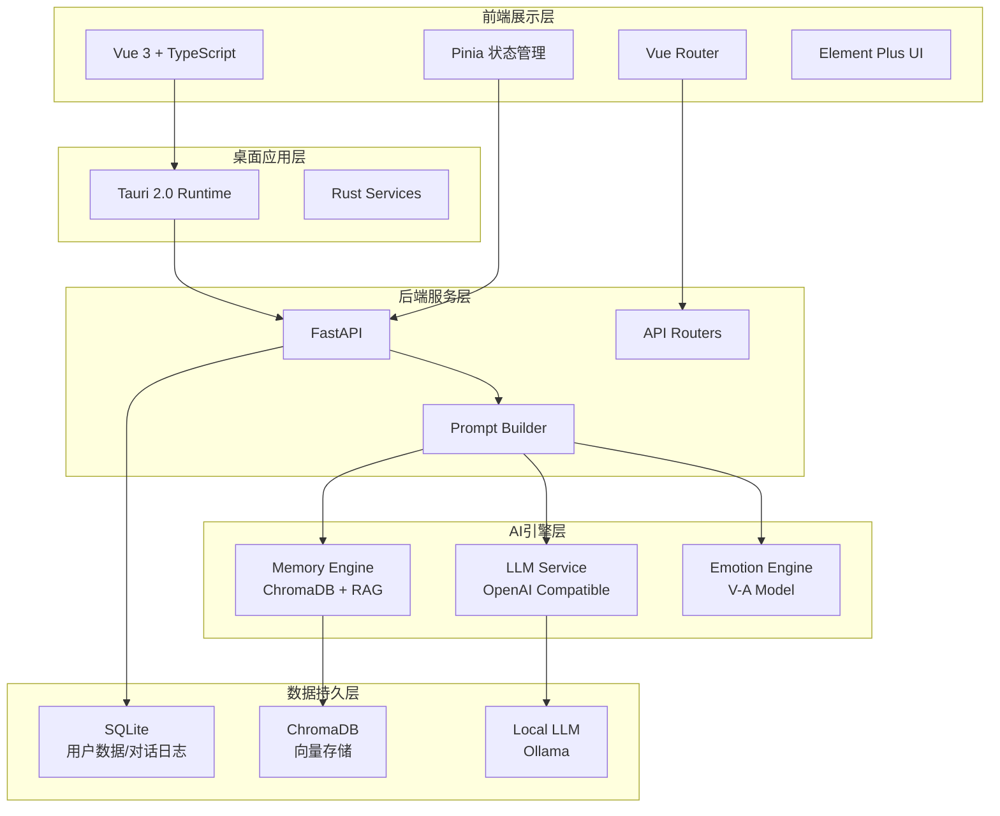
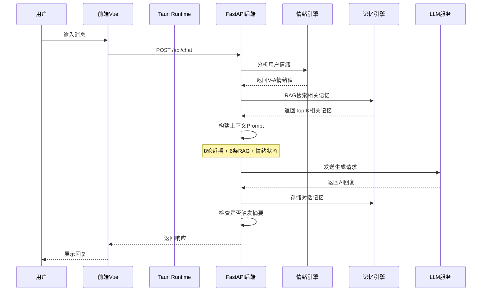
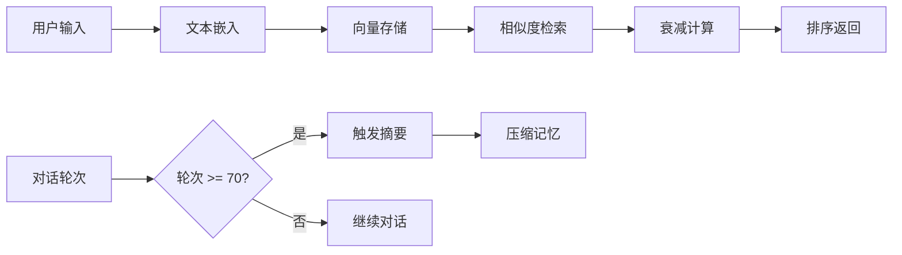

# Yumi

## 一、系统架构

### 1.1 整体架构概览

Yumi采用分层架构设计，由前端展示层、桌面应用层、后端服务层、AI引擎层和数据持久层五部分组成，实现了关注点分离与高内聚低耦合的设计目标。



### 1.2 核心数据流



### 1.3 模块职责划分

| 层级 | 模块 | 核心职责 |
|------|------|----------|
| 前端展示层 | Vue 3 + TypeScript | 用户界面渲染、交互逻辑处理、状态管理 |
| 桌面应用层 | Tauri 2.0 | 跨平台桌面封装、本地资源访问、进程管理 |
| 后端服务层 | FastAPI | API路由、请求处理、服务编排、数据验证 |
| AI引擎层 | Memory/Emotion/LLM | 记忆检索、情绪分析、文本生成 |
| 数据持久层 | SQLite/ChromaDB | 结构化数据存储、向量数据索引 |

---

## 二、技术说明

### 2.1 前端技术栈

#### 2.1.1 Vue 3 + TypeScript

项目采用Vue 3作为前端框架，结合TypeScript实现类型安全的开发体验。Vue 3的Composition API提供了更灵活的代码组织方式，便于逻辑复用与测试。

**技术选型依据：**

- **响应式系统**：Vue 3基于Proxy的响应式系统相比Vue 2的Object.defineProperty方案，支持了更多数据类型（如Map、Set），并消除了数组索引更新的限制，性能提升显著。
- **Composition API**：提供了比Options API更优的代码组织方式，支持将相关逻辑聚合为可复用的组合式函数，符合软件工程的关注点分离原则。
- **TypeScript原生支持**：Vue 3从设计之初便考虑TypeScript支持，类型推导完善，开发体验优异。

**实战应用：**

项目中的状态管理采用Pinia，利用Composition API风格定义Store：

```typescript
export const useChatStore = defineStore('chat', () => {
  const messages = ref<ChatMessage[]>([])
  const isLoading = ref(false)
  
  async function sendMessage(content: string) {
    // 消息发送逻辑
  }
  
  return { messages, isLoading, sendMessage }
})
```

#### 2.1.2 Element Plus

Element Plus是基于Vue 3的企业级UI组件库，提供了丰富的预设组件与完善的设计规范。

**技术选型依据：**

- **设计一致性**：遵循统一的设计语言，确保界面风格一致
- **国际化支持**：内置多语言支持，便于扩展
- **主题定制**：支持CSS变量覆盖，实现主题切换功能

**参考资料：** [Element Plus官方文档](https://element-plus.org/)

### 2.2 桌面应用技术

#### 2.2.1 Tauri 2.0

Tauri是一个使用Rust构建跨平台桌面应用的框架，相比Electron具有更小的打包体积与更高的安全性。

**技术选型依据：**

- **体积优势**：Tauri应用打包体积通常小于10MB，而Electron应用通常超过100MB。这是因为Tauri复用系统WebView，而非打包Chromium。
- **安全性**：Rust语言的安全特性（所有权系统、借用检查）有效防止内存安全问题。Tauri还提供了细粒度的权限控制系统。
- **性能**：Rust后端性能优异，异步运行时Tokio提供高并发处理能力。

**架构设计：**

Tauri采用前后端分离架构，前端通过IPC（进程间通信）调用Rust后端命令：

```rust
.invoke_handler(tauri::generate_handler![
    commands::chat::send_message,
    commands::memory::search_memory,
    commands::settings::get_settings,
])
```

**参考资料：** [Tauri官方文档](https://tauri.app/v2/guides/)

#### 2.2.2 Rust异步编程

项目使用Tokio作为异步运行时，结合async/await语法实现高效的异步IO操作。

**技术原理：**

Tokio基于epoll（Linux）、IOCP（Windows）、kqueue（macOS）实现高效的事件驱动模型，避免了线程阻塞带来的资源浪费。

**参考资料：** [Tokio官方教程](https://tokio.rs/tokio/tutorial)

### 2.3 后端服务技术

#### 2.3.1 FastAPI

FastAPI是现代高性能Python Web框架，基于Starlette和Pydantic构建。

**技术选型依据：**

- **高性能**：基于ASGI协议，性能媲美Node.js和Go
- **自动文档**：基于OpenAPI规范自动生成API文档
- **类型验证**：Pydantic提供运行时数据验证，与TypeScript前端形成类型契约

**生命周期管理：**

项目利用FastAPI的lifespan上下文管理器实现服务的优雅启动与关闭：

```python
@asynccontextmanager
async def lifespan(app: FastAPI):
    # 初始化服务
    await init_db()
    memory_engine = MemoryEngine()
    await memory_engine.initialize()
    yield
    # 清理资源
    await memory_engine.close()
```

**参考资料：** [FastAPI官方文档](https://fastapi.tiangolo.com/)

#### 2.3.2 异步数据库访问

项目采用aiosqlite实现SQLite的异步访问，配合SQLAlchemy Core构建查询。

**技术原理：**

传统同步数据库驱动会阻塞事件循环，导致并发性能下降。aiosqlite通过线程池将阻塞操作转换为异步接口，保持事件循环的响应性。

### 2.4 AI引擎技术

#### 2.4.1 记忆引擎（Memory Engine）

记忆引擎是Yumi的核心创新点，实现了基于向量检索的长时记忆系统。

**技术架构：**



**核心技术点：**

1. **向量嵌入与检索**

项目使用ChromaDB作为向量数据库，结合Sentence-Transformers模型生成文本嵌入向量。

**理论依据：**

向量语义检索基于分布式语义假设（Distributional Semantics），即语义相近的词在向量空间中距离较近。Sentence-Transformers采用Siamese Network架构，通过对比学习优化句子级别的语义表示。

**参考资料：** 
- [Sentence-BERT论文](https://arxiv.org/abs/1908.10084)
- [ChromaDB文档](https://www.trychroma.com/)

2. **艾宾浩斯遗忘曲线**

记忆引擎实现了基于艾宾浩斯遗忘曲线的记忆衰减机制：

```python
def _calculate_decay(self, timestamp_str: str) -> float:
    days_elapsed = (datetime.now() - timestamp).days
    decay = 1 - 0.003 * days_elapsed  # 线性衰减近似
    return max(decay, 0.1)  # 保留最低权重
```

**理论依据：**

艾宾浩斯遗忘曲线描述了记忆保持量随时间衰减的规律。虽然原始曲线为非线性，但项目采用线性近似以简化计算，同时保留核心思想：时间越久，记忆权重越低。

**参考资料：** [艾宾浩斯遗忘曲线](https://en.wikipedia.org/wiki/Forgetting_curve)

3. **对话摘要机制**

系统每70轮对话触发一次摘要压缩，防止上下文无限增长：

```python
if turn_count > 0 and turn_count % 70 == 0:
    new_summary = await memory_engine.summarize(user_id)
```

**技术原理：**

摘要机制借鉴了人类工作记忆的有限容量特性（Miller's Law，7±2个信息块）。通过周期性压缩，系统在保留关键信息的同时，控制了计算复杂度。

#### 2.4.2 情绪引擎（Emotion Engine）

情绪引擎实现了基于效价-唤醒度（Valence-Arousal）模型的情绪分析。

**技术架构：**

```mermaid
graph TB
    A[输入文本] --> B[正向词匹配]
    A --> C[负向词匹配]
    A --> D[高唤醒词匹配]
    A --> E[低唤醒词匹配]
    
    B --> F[效价值计算]
    C --> F
    D --> G[唤醒度计算]
    E --> G
    
    F --> H[情绪标签映射]
    G --> H
    
    H --> I[共情响应生成]
```

**理论依据：**

效价-唤醒度模型是情绪心理学中广泛采用的二维情绪表征模型。效价（Valence）表示情绪的正负极性，唤醒度（Arousal）表示情绪的激活强度。该模型能够有效表征大多数基本情绪状态。

**参考资料：** 
- [Russell情绪环形模型](https://psycnet.apa.org/record/1981-25062-001)
- [情绪维度理论综述](https://doi.org/10.1037/0033-295X.97.3.419)

**实现细节：**

```python
class EmotionEngine:
    async def analyze(self, text: str) -> EmotionData:
        # 统计情感词汇
        positive_count = sum(1 for word in self.positive_words if word in text)
        negative_count = sum(1 for word in self.negative_words if word in text)
        
        # 计算效价值
        valence = (positive_count - negative_count) * 0.15
        valence = max(-1.0, min(1.0, valence))
        
        return EmotionData(valence=valence, arousal=arousal)
```

#### 2.4.3 LLM服务

LLM服务采用OpenAI兼容API接口，支持多种本地/云端模型部署。

**技术选型依据：**

- **接口标准化**：OpenAI API已成为事实上的行业标准，主流开源模型均提供兼容接口
- **本地部署支持**：通过Ollama等工具，可在本地部署开源模型，保护用户隐私
- **流式响应**：支持Server-Sent Events实现打字机效果

**实战配置：**

```python
class LLMService:
    def __init__(
        self,
        api_endpoint: str = "http://127.0.0.1:11434/v1",  # Ollama默认端点
        model_name: str = "llama3.1:8b",
        default_temperature: float = 0.85
    ):
        # 服务配置
```

**参考资料：** 
- [OpenAI API文档](https://platform.openai.com/docs/api-reference)
- [Ollama项目](https://github.com/ollama/ollama)

#### 2.4.4 提示构建器（Prompt Builder）

提示构建器负责整合多源信息，构建LLM输入上下文。

**上下文构建策略：**

```
┌─────────────────────────────────────────┐
│              System Prompt              │
│  - 人格特质（大五人格模型）                │
│  - 对话风格设定                          │
│  - 用户情绪状态                          │
├─────────────────────────────────────────┤
│           Recent Context (8轮)          │
│  - 最近8轮对话历史                        │
├─────────────────────────────────────────┤
│            RAG Memory (6条)             │
│  - 向量检索相关记忆                       │
├─────────────────────────────────────────┤
│              User Message               │
└─────────────────────────────────────────┘
```

**大五人格模型（Big Five Model）：**

项目采用大五人格模型定义AI角色特质，包括开放性（Openness）、尽责性（Conscientiousness）、外向性（Extraversion）、宜人性（Agreeableness）、神经质（Neuroticism）五个维度。

**理论依据：**

大五人格模型是人格心理学中最具实证支持的人格理论框架。通过调整五个维度的值，可以塑造出不同性格特征的AI角色。

**参考资料：** 
- [大五人格理论](https://en.wikipedia.org/wiki/Big_Five_personality_traits)
- [人格心理学手册](https://www.apa.org/pubs/books/4310240)

### 2.5 数据存储技术

#### 2.5.1 SQLite

SQLite作为轻量级嵌入式数据库，用于存储用户配置、对话日志等结构化数据。

**技术选型依据：**

- **零配置**：无需独立数据库服务，简化部署
- **单文件存储**：便于数据迁移与备份
- **ACID事务**：保证数据一致性

#### 2.5.2 ChromaDB

ChromaDB是专为AI应用设计的开源向量数据库，支持向量存储、相似度检索等功能。

**技术特性：**

- **持久化存储**：支持将向量数据持久化到本地磁盘
- **元数据过滤**：支持基于元数据的条件过滤
- **多种距离度量**：支持L2、余弦相似度等距离计算方式

**参考资料：** [ChromaDB文档](https://docs.trychroma.com/)

---

## 三、项目结构

```
Yumi/
├── src/                    # Vue前端源码
│   ├── api/               # API接口封装
│   ├── components/        # Vue组件
│   ├── router/            # 路由配置
│   ├── stores/            # Pinia状态管理
│   ├── styles/            # 全局样式
│   ├── types/             # TypeScript类型定义
│   └── views/             # 页面视图
├── src-tauri/             # Tauri/Rust后端
│   ├── src/
│   │   ├── commands/      # Tauri命令
│   │   └── services/      # Rust服务
│   └── Cargo.toml
├── backend/               # Python FastAPI后端
│   ├── routers/           # API路由
│   ├── services/          # 业务服务
│   │   ├── emotion.py     # 情绪引擎
│   │   ├── llm.py         # LLM服务
│   │   ├── memory.py      # 记忆引擎
│   │   └── prompt_builder.py
│   └── requirements.txt
├── data/                  # 数据目录
│   ├── chroma/           # 向量数据库
│   └── yumi.db           # SQLite数据库
└── package.json
```
