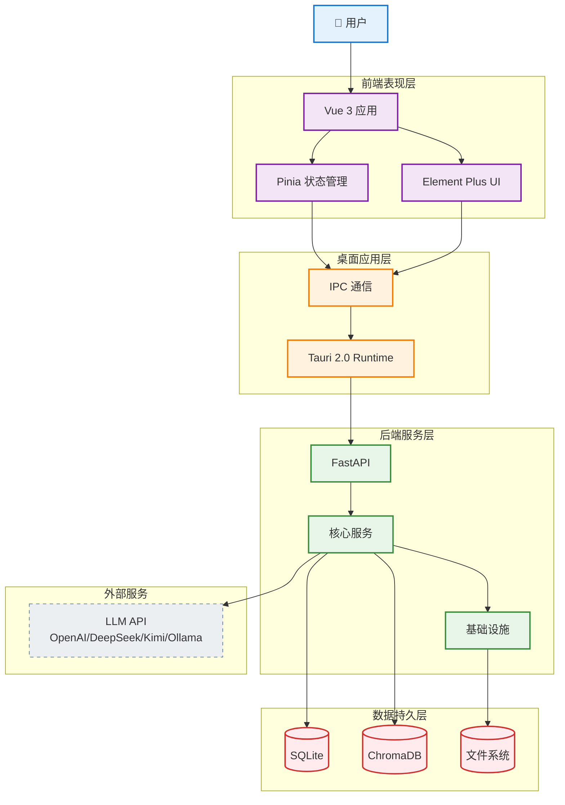
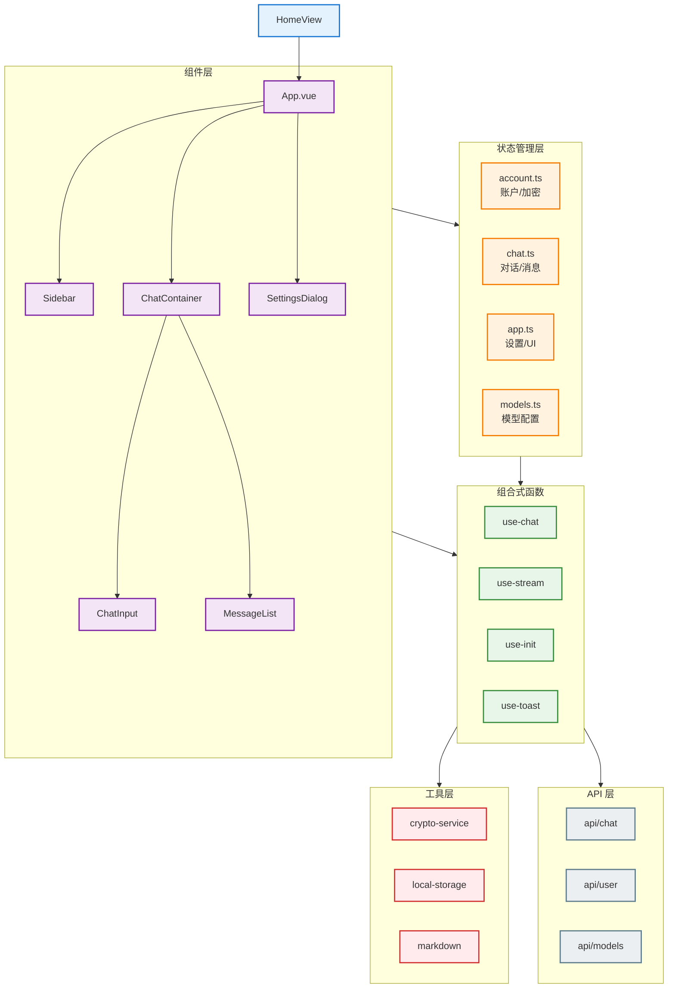
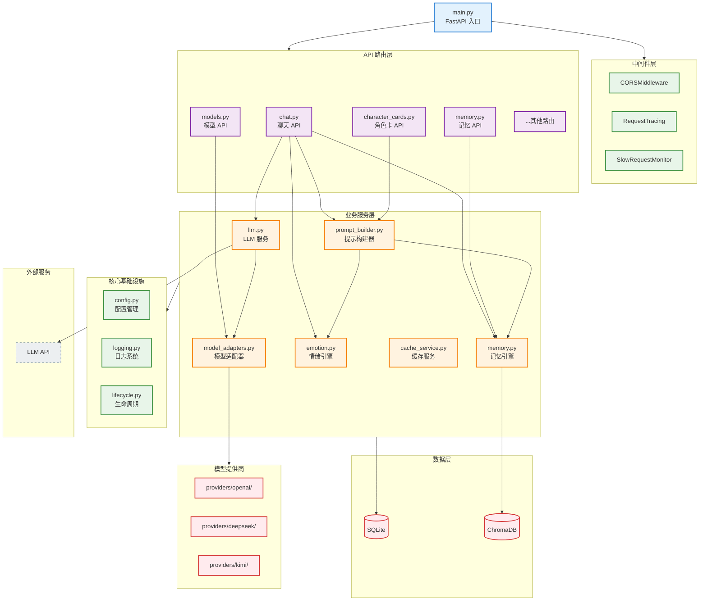
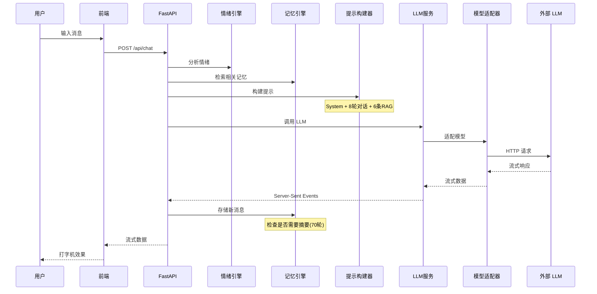

# Yumi 架构设计

## 目录

1. [系统总体架构](#1-系统总体架构)
2. [前端架构](#2-前端架构)
3. [后端架构](#3-后端架构)
4. [核心数据流](#4-核心数据流)
5. [核心模块概览](#5-核心模块概览)
6. [配置管理](#6-配置管理)
7. [开发工具](#7-开发工具)

---

## 文档导航

| 相关文档 | 说明 |
|---------|------|
| [项目 README](../README.md) | 项目概览、快速开始 |
| [API 文档](./api.md) | 完整的 RESTful API 接口 |
| [记忆引擎](./memory-engine.md) | 记忆引擎详细设计 |
| [情绪引擎](./emotion-engine.md) | 情绪引擎详细设计 |

---

## 1. 系统总体架构



### 1.1 技术栈概览

| 层级 | 核心技术 | 说明 |
|------|---------|------|
| 前端 | Vue 3.4, TypeScript, Pinia, Vite | 响应式 UI、状态管理 |
| 桌面 | Tauri 2.0, Rust | 轻量级跨平台桌面 |
| 后端 | FastAPI 0.110, SQLAlchemy 2.0 | 异步 API、ORM |
| 数据库 | SQLite, ChromaDB 0.4.22 | 结构化数据 + 向量检索 |
| 外部 | OpenAI 兼容 API | 多模型提供商支持 |

> **详细文档**：
> - API 接口：[API 文档](./api.md)
> - 记忆引擎：[记忆引擎](./memory-engine.md)
> - 情绪引擎：[情绪引擎](./emotion-engine.md)

---

## 2. 前端架构



### 2.1 状态管理职责

| Store | 主要职责 |
|-------|---------|
| account.ts | 账户加密、密钥管理、角色卡、对话历史 |
| chat.ts | 当前对话、消息列表、生成状态 |
| app.ts | 应用设置、UI 状态 |
| models.ts | 模型列表、模型配置 |

---

## 3. 后端架构



### 3.1 核心服务说明

| 服务 | 职责 |
|------|------|
| LLMService | 调用外部 LLM API，处理流式响应 |
| MemoryEngine | 向量检索、记忆衰减、对话摘要 |
| EmotionEngine | 情绪分析、V-A 模型计算 |
| PromptBuilder | 整合多源信息，构建 LLM 上下文 |
| ModelAdapters | YAML 配置驱动的模型适配器 |

---

## 4. 核心数据流

### 4.1 聊天请求流程



---

## 5. 核心模块概览

### 5.1 模型适配器

**设计模式**：配置驱动的适配器模式

**扩展方式**：通过 YAML 配置文件添加新的模型提供商，无需修改核心代码。

**配置位置**：`backend/services/providers/`

### 5.2 记忆引擎

**核心功能**：向量检索、记忆衰减、对话摘要

> **详细设计**请参考 [记忆引擎](./memory-engine.md)。

### 5.3 情绪引擎

**模型**：效价-唤醒度（V-A）二维模型

> **详细设计**请参考 [情绪引擎](./emotion-engine.md)。

### 5.4 提示构建器

**职责**：整合多源信息，构建 LLM 输入上下文

---

## 6. 配置管理

### 6.1 配置加载优先级

```
环境变量 > YAML 配置文件 > 默认值
```

### 6.2 环境变量前缀

| 配置类 | 前缀 |
|--------|------|
| AppConfig | `YUMI_` |
| ServerConfig | `YUMI_SERVER_` |
| DatabaseConfig | `YUMI_DB_` |
| VectorDBConfig | `YUMI_VECTOR_` |
| LLMConfig | `YUMI_LLM_` |
| MemoryConfig | `YUMI_MEMORY_` |
| EmotionConfig | `YUMI_EMOTION_` |
| LoggingConfig | `YUMI_LOG_` |

### 6.3 配置文件

- `config.yaml` - YAML 配置文件（可选）
- `.env` - 环境变量文件（可选）

---

## 7. 开发工具

### 7.1 代码规范

| 层级 | 工具 |
|------|------|
| 前端 | ESLint, Prettier |
| 后端 | Ruff, Black, MyPy |

### 7.2 CI/CD

- **平台**：GitHub Actions
- **配置文件**：`.github/workflows/ci.yml`
- **前端检查**：lint + build
- **后端检查**：ruff + black --check
