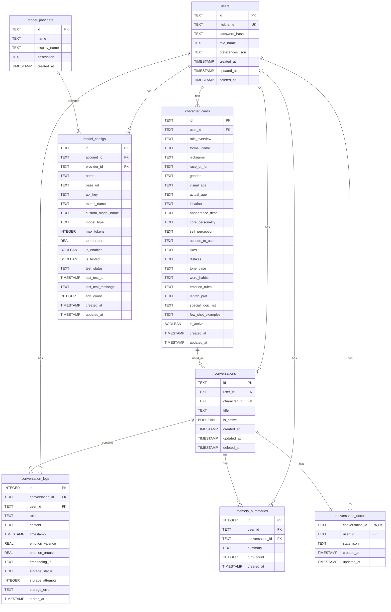

# Yumi 数据库设计文档

## 1. 需求分析

### 1.1 业务场景概述

Yumi 是一个 AI 虚拟伴侣应用，核心业务场景包括：

1. **用户认证管理** - 用户注册、登录、Token 管理
2. **角色卡管理** - 创建、编辑、删除 AI 角色卡
3. **对话管理** - 创建对话、发送消息、历史记录
4. **模型配置** - 配置 AI 模型提供商、API 密钥、参数
5. **记忆系统** - 对话总结、长期记忆存储
6. **日志审计** - 系统日志、对话日志、审计日志

### 1.2 数据存储需求

| 业务模块 | 数据实体 | 存储需求 |
|---------|---------|---------|
| 用户认证 | 用户账号 | 持久化存储，包含认证信息 |
| 角色卡 | 角色配置 | 持久化存储，支持多角色 |
| 对话 | 对话实例、消息 | 持久化存储，支持历史查询 |
| 模型 | 提供商配置、模型配置 | 持久化存储，用户级隔离 |
| 记忆 | 对话总结、状态 | 持久化存储，支持检索 |
| 日志 | 系统日志、审计日志 | 独立存储，支持分析 |

### 1.3 数据关系图

```
┌─────────────┐     ┌─────────────────┐     ┌─────────────┐
│    users    │────▶│ character_cards │═════╪═════════════│
└──────┬──────┘     └─────────────────┘     │   settings  │
       │                   │                └─────────────┘
       │                   │
       │            ┌──────┴──────┐ (强关联-级联删除)
       │            ▼              │
       │     ┌─────────────────┐   │
       └────▶│  conversations  │◀──┘
             └────────┬────────┘
                      │ (级联删除)
                      ▼
             ┌─────────────────┐     ┌─────────────────┐
             │conversation_logs │     │memory_summaries │
             └─────────────────┘     └─────────────────┘
                      ▲
                      │ (级联删除)
             ┌────────┴────────┐
             │conversation_    │
             │states           │
             └─────────────────┘

┌─────────────┐     ┌─────────────────┐
│model_       │◀────│  model_configs  │◀── users
│providers    │     └─────────────────┘
└─────────────┘

[日志数据库]
┌─────────────────┐     ┌─────────────────┐
│ system_logs     │     │ audit_logs      │
└─────────────────┘     └─────────────────┘
┌─────────────────────────┐
│dialogue_interaction_logs│
└─────────────────────────┘
```

**关系说明：**
- `character_cards` → `conversations`: **强关联（级联删除）**，删除角色卡时自动删除该角色卡下的所有会话
- `conversations` → `conversation_logs`: **级联删除**，删除会话时自动删除所有消息
- `users` → 其他表: **级联删除**，删除用户时自动删除所有关联数据

## 2. 表结构设计

### 2.1 用户认证模块

#### 2.1.1 users（用户表）

存储用户账号信息。

| 字段名 | 数据类型 | 约束 | 说明 |
|-------|---------|------|------|
| id | TEXT | PRIMARY KEY | 用户唯一标识（UUID） |
| nickname | TEXT | UNIQUE, NOT NULL | 用户昵称，用于登录 |
| password_hash | TEXT | NOT NULL | 密码哈希（bcrypt） |
| role_name | TEXT | DEFAULT 'Yumi' | 角色名称（显示用） |
| preferences_json | TEXT | NULL | 用户偏好设置（JSON） |
| created_at | TIMESTAMP | DEFAULT CURRENT_TIMESTAMP | 创建时间 |
| updated_at | TIMESTAMP | DEFAULT CURRENT_TIMESTAMP | 更新时间 |
| deleted_at | TIMESTAMP | NULL | 软删除时间 |

**索引：**
```sql
CREATE INDEX idx_users_nickname ON users(nickname);
CREATE INDEX idx_users_created_at ON users(created_at);
```

**说明：**
- 使用 UUID 作为主键，避免顺序猜测攻击
- 支持软删除，保留用户数据可追溯
- 偏好设置使用 JSON 存储，灵活扩展

---

### 2.2 角色卡模块

#### 2.2.1 character_cards（角色卡表）

存储 AI 角色卡配置信息。

| 字段名 | 数据类型 | 约束 | 说明 |
|-------|---------|------|------|
| id | TEXT | PRIMARY KEY | 角色卡唯一标识 |
| user_id | TEXT | NOT NULL, FK | 所属用户ID |
| role_overview | TEXT | DEFAULT '' | 角色概述 |
| formal_name | TEXT | DEFAULT '' | 正式名称 |
| nickname | TEXT | DEFAULT '' | 昵称 |
| race_or_form | TEXT | DEFAULT '人类' | 种族或形态 |
| gender | TEXT | DEFAULT '中性' | 性别 |
| visual_age | TEXT | DEFAULT '' | 视觉年龄 |
| actual_age | TEXT | DEFAULT '' | 实际年龄 |
| location | TEXT | DEFAULT '' | 所在位置 |
| appearance_desc | TEXT | DEFAULT '' | 外貌描述 |
| core_personality | TEXT | DEFAULT '' | 核心性格 |
| self_perception | TEXT | DEFAULT '' | 自我认知 |
| attitude_to_user | TEXT | DEFAULT '' | 对用户态度 |
| likes | TEXT | DEFAULT '' | 喜好 |
| dislikes | TEXT | DEFAULT '' | 厌恶 |
| tone_base | TEXT | DEFAULT '' | 语气基调 |
| word_habits | TEXT | DEFAULT '' | 用词习惯 |
| emotion_rules | TEXT | DEFAULT '' | 情绪规则 |
| length_pref | TEXT | DEFAULT '' | 长度偏好 |
| special_logic_list | TEXT | DEFAULT '' | 特殊逻辑 |
| few_shot_examples | TEXT | DEFAULT '' | 示例对话 |
| is_active | BOOLEAN | DEFAULT 1 | 是否激活 |
| created_at | TIMESTAMP | DEFAULT CURRENT_TIMESTAMP | 创建时间 |
| updated_at | TIMESTAMP | DEFAULT CURRENT_TIMESTAMP | 更新时间 |

**外键约束：**
```sql
FOREIGN KEY (user_id) REFERENCES users(id) ON DELETE CASCADE
```

**索引：**
```sql
CREATE INDEX idx_character_cards_user ON character_cards(user_id);
CREATE INDEX idx_character_cards_active ON character_cards(user_id, is_active);
CREATE INDEX idx_character_cards_updated ON character_cards(updated_at DESC);
```

**说明：**
- 角色卡与用户强关联，用户删除时级联删除
- **角色卡与会话强关联，角色卡删除时级联删除该角色卡下的所有会话和消息**
- 支持多角色卡，通过 is_active 控制默认角色
- 所有文本字段都有默认值，避免 NULL 处理

---

### 2.3 对话模块

#### 2.3.1 conversations（对话表）

存储对话实例信息。

| 字段名 | 数据类型 | 约束 | 说明 |
|-------|---------|------|------|
| id | TEXT | PRIMARY KEY | 对话唯一标识 |
| user_id | TEXT | NOT NULL, FK | 所属用户ID |
| character_id | TEXT | NULL, FK | 关联角色卡ID |
| title | TEXT | NULL | 对话标题 |
| is_active | BOOLEAN | DEFAULT 1 | 是否激活 |
| created_at | TIMESTAMP | DEFAULT CURRENT_TIMESTAMP | 创建时间 |
| updated_at | TIMESTAMP | DEFAULT CURRENT_TIMESTAMP | 更新时间 |
| deleted_at | TIMESTAMP | NULL | 软删除时间 |

**外键约束：**
```sql
FOREIGN KEY (user_id) REFERENCES users(id) ON DELETE CASCADE
FOREIGN KEY (character_id) REFERENCES character_cards(id) ON DELETE CASCADE
```

**索引：**
```sql
CREATE INDEX idx_conversations_user ON conversations(user_id);
CREATE INDEX idx_conversations_user_active ON conversations(user_id, is_active);
CREATE INDEX idx_conversations_character ON conversations(character_id);
CREATE INDEX idx_conversations_updated ON conversations(updated_at DESC);
```

**说明：**
- **角色卡与会话强关联，角色卡删除时会话同步删除（CASCADE）**
- 对话与用户强关联，用户删除时级联删除
- 支持软删除，保留对话历史

#### 2.3.2 conversation_logs（对话消息表）

存储对话中的消息记录。

| 字段名 | 数据类型 | 约束 | 说明 |
|-------|---------|------|------|
| id | INTEGER | PRIMARY KEY AUTOINCREMENT | 消息自增ID |
| conversation_id | TEXT | NOT NULL, FK | 所属对话ID |
| user_id | TEXT | NOT NULL, FK | 所属用户ID |
| role | TEXT | NOT NULL | 角色（user/assistant） |
| content | TEXT | NOT NULL | 消息内容 |
| timestamp | TIMESTAMP | DEFAULT CURRENT_TIMESTAMP | 发送时间 |
| emotion_valence | REAL | NULL | 情感效价（-1~1） |
| emotion_arousal | REAL | NULL | 情感唤醒度（0~1） |
| embedding_id | TEXT | NULL | 向量嵌入ID |
| storage_status | TEXT | DEFAULT 'pending' | 存储状态 |
| storage_attempts | INTEGER | DEFAULT 0 | 存储尝试次数 |
| storage_error | TEXT | NULL | 存储错误信息 |
| stored_at | TIMESTAMP | NULL | 成功存储时间 |

**外键约束：**
```sql
FOREIGN KEY (user_id) REFERENCES users(id) ON DELETE CASCADE
FOREIGN KEY (conversation_id) REFERENCES conversations(id) ON DELETE CASCADE
```

**索引：**
```sql
CREATE INDEX idx_conversation_logs_user_time ON conversation_logs(user_id, timestamp DESC);
CREATE INDEX idx_conversation_logs_conversation ON conversation_logs(conversation_id);
CREATE INDEX idx_conversation_logs_conversation_time ON conversation_logs(conversation_id, timestamp);
CREATE INDEX idx_conversation_logs_storage_status ON conversation_logs(storage_status);
CREATE INDEX idx_conversation_logs_embedding ON conversation_logs(embedding_id);
```

**说明：**
- 消息与对话强关联，对话删除时级联删除
- 支持情感分析数据存储
- 支持向量检索（通过 embedding_id）
- 支持异步存储状态追踪

---

### 2.4 记忆模块

#### 2.4.1 memory_summaries（记忆总结表）

存储对话的总结信息，用于长期记忆。

| 字段名 | 数据类型 | 约束 | 说明 |
|-------|---------|------|------|
| id | INTEGER | PRIMARY KEY AUTOINCREMENT | 自增ID |
| user_id | TEXT | NOT NULL, FK | 所属用户ID |
| conversation_id | TEXT | NULL, FK | 关联对话ID |
| summary | TEXT | NOT NULL | 总结内容 |
| turn_count | INTEGER | DEFAULT 0 | 对话轮数 |
| created_at | TIMESTAMP | DEFAULT CURRENT_TIMESTAMP | 创建时间 |

**外键约束：**
```sql
FOREIGN KEY (user_id) REFERENCES users(id) ON DELETE CASCADE
FOREIGN KEY (conversation_id) REFERENCES conversations(id) ON DELETE SET NULL
```

**索引：**
```sql
CREATE INDEX idx_memory_summaries_user ON memory_summaries(user_id);
CREATE INDEX idx_memory_summaries_conversation ON memory_summaries(conversation_id);
CREATE INDEX idx_memory_summaries_created ON memory_summaries(created_at DESC);
```

#### 2.4.2 conversation_states（对话状态表）

存储对话的当前状态（用于恢复对话上下文）。

| 字段名 | 数据类型 | 约束 | 说明 |
|-------|---------|------|------|
| conversation_id | TEXT | PRIMARY KEY, FK | 对话ID |
| user_id | TEXT | NOT NULL, FK | 所属用户ID |
| state_json | TEXT | NOT NULL | 状态数据（JSON） |
| created_at | TIMESTAMP | DEFAULT CURRENT_TIMESTAMP | 创建时间 |
| updated_at | TIMESTAMP | DEFAULT CURRENT_TIMESTAMP | 更新时间 |

**外键约束：**
```sql
FOREIGN KEY (user_id) REFERENCES users(id) ON DELETE CASCADE
FOREIGN KEY (conversation_id) REFERENCES conversations(id) ON DELETE CASCADE
```

**索引：**
```sql
CREATE INDEX idx_conversation_states_user ON conversation_states(user_id);
CREATE INDEX idx_conversation_states_updated ON conversation_states(updated_at DESC);
```

---

### 2.5 模型配置模块

#### 2.5.1 model_providers（模型提供商表）

存储支持的模型提供商信息。

| 字段名 | 数据类型 | 约束 | 说明 |
|-------|---------|------|------|
| id | TEXT | PRIMARY KEY | 提供商唯一标识 |
| name | TEXT | NOT NULL | 提供商名称（内部标识） |
| display_name | TEXT | NOT NULL | 显示名称 |
| description | TEXT | NULL | 描述 |
| created_at | TIMESTAMP | DEFAULT CURRENT_TIMESTAMP | 创建时间 |

**索引：**
```sql
CREATE INDEX idx_model_providers_name ON model_providers(name);
```

**初始数据：**
```sql
INSERT INTO model_providers (id, name, display_name, description) VALUES
('deepseek', 'deepseek', 'DeepSeek', 'DeepSeek AI - 高性能大语言模型'),
('kimi', 'kimi', 'Kimi', 'Moonshot AI - Kimi 系列模型'),
('custom', 'custom', '自定义', '自定义 API 提供商');
```

#### 2.5.2 model_configs（模型配置表）

存储用户的模型配置信息。

| 字段名 | 数据类型 | 约束 | 说明 |
|-------|---------|------|------|
| id | TEXT | PRIMARY KEY | 配置唯一标识 |
| account_id | TEXT | NOT NULL, FK | 所属用户ID |
| provider_id | TEXT | NOT NULL, FK | 提供商ID |
| name | TEXT | NOT NULL | 配置名称 |
| base_url | TEXT | NOT NULL | API 基础URL |
| api_key | TEXT | NULL | API 密钥（加密存储） |
| model_name | TEXT | NOT NULL | 模型名称 |
| custom_model_name | TEXT | NULL | 自定义模型名称 |
| model_type | TEXT | DEFAULT 'text' | 模型类型 |
| max_tokens | INTEGER | DEFAULT 4096 | 最大Token数 |
| temperature | REAL | DEFAULT 0.85 | 温度参数 |
| is_enabled | BOOLEAN | DEFAULT 0 | 是否启用 |
| is_tested | BOOLEAN | DEFAULT 0 | 是否测试过 |
| test_status | TEXT | DEFAULT 'untested' | 测试状态 |
| last_test_at | TIMESTAMP | NULL | 最后测试时间 |
| last_test_message | TEXT | NULL | 测试消息 |
| edit_count | INTEGER | DEFAULT 0 | 编辑次数 |
| created_at | TIMESTAMP | DEFAULT CURRENT_TIMESTAMP | 创建时间 |
| updated_at | TIMESTAMP | DEFAULT CURRENT_TIMESTAMP | 更新时间 |

**外键约束：**
```sql
FOREIGN KEY (account_id) REFERENCES users(id) ON DELETE CASCADE
FOREIGN KEY (provider_id) REFERENCES model_providers(id) ON DELETE RESTRICT
```

**索引：**
```sql
CREATE INDEX idx_model_configs_account ON model_configs(account_id);
CREATE INDEX idx_model_configs_provider ON model_configs(provider_id);
CREATE INDEX idx_model_configs_account_enabled ON model_configs(account_id, is_enabled);
CREATE INDEX idx_model_configs_enabled ON model_configs(is_enabled);
```

**说明：**
- API 密钥需要加密存储
- 提供商删除时阻止（RESTRICT），避免配置孤立

---

### 2.6 系统配置模块

#### 2.6.1 settings（系统设置表）

存储系统级配置。

| 字段名 | 数据类型 | 约束 | 说明 |
|-------|---------|------|------|
| key | TEXT | PRIMARY KEY | 设置键 |
| value | TEXT | NOT NULL | 设置值 |
| updated_at | TIMESTAMP | DEFAULT CURRENT_TIMESTAMP | 更新时间 |

---

### 2.7 日志模块（独立数据库）

#### 2.7.1 system_logs（系统日志表）

存储系统运行日志。

| 字段名 | 数据类型 | 约束 | 说明 |
|-------|---------|------|------|
| id | INTEGER | PRIMARY KEY AUTOINCREMENT | 自增ID |
| timestamp | TIMESTAMP | NOT NULL | 日志时间 |
| level | TEXT | NOT NULL | 日志级别 |
| event_type | TEXT | NOT NULL | 事件类型 |
| trace_id | TEXT | NULL | 追踪ID |
| user_id | TEXT | NULL | 关联用户ID |
| session_id | TEXT | NULL | 会话ID |
| content | TEXT | NOT NULL | 日志内容 |
| created_at | TIMESTAMP | DEFAULT CURRENT_TIMESTAMP | 创建时间 |

**索引：**
```sql
CREATE INDEX idx_system_logs_timestamp ON system_logs(timestamp);
CREATE INDEX idx_system_logs_level ON system_logs(level);
CREATE INDEX idx_system_logs_event_type ON system_logs(event_type);
CREATE INDEX idx_system_logs_trace_id ON system_logs(trace_id);
CREATE INDEX idx_system_logs_user_id ON system_logs(user_id);
```

#### 2.7.2 audit_logs（审计日志表）

存储用户操作审计日志。

| 字段名 | 数据类型 | 约束 | 说明 |
|-------|---------|------|------|
| id | INTEGER | PRIMARY KEY AUTOINCREMENT | 自增ID |
| timestamp | TIMESTAMP | NOT NULL | 操作时间 |
| user_id | TEXT | NULL | 操作用户ID |
| action | TEXT | NOT NULL | 操作类型 |
| resource_type | TEXT | NOT NULL | 资源类型 |
| resource_id | TEXT | NULL | 资源ID |
| result | TEXT | NOT NULL | 操作结果 |
| client_ip | TEXT | NULL | 客户端IP |
| details | TEXT | NULL | 详细信息（JSON） |
| created_at | TIMESTAMP | DEFAULT CURRENT_TIMESTAMP | 创建时间 |

**索引：**
```sql
CREATE INDEX idx_audit_logs_timestamp ON audit_logs(timestamp);
CREATE INDEX idx_audit_logs_user_id ON audit_logs(user_id);
CREATE INDEX idx_audit_logs_action ON audit_logs(action);
CREATE INDEX idx_audit_logs_resource ON audit_logs(resource_type, resource_id);
```

#### 2.7.3 dialogue_interaction_logs（对话交互日志表）

存储详细的对话交互信息，用于分析和优化。

| 字段名 | 数据类型 | 约束 | 说明 |
|-------|---------|------|------|
| id | INTEGER | PRIMARY KEY AUTOINCREMENT | 自增ID |
| conversation_id | TEXT | NULL | 对话ID |
| user_id | TEXT | NOT NULL | 用户ID |
| character_id | TEXT | NULL | 角色卡ID |
| request_detail | TEXT | NOT NULL | 请求详情（JSON） |
| response_detail | TEXT | NULL | 响应详情（JSON） |
| start_time | TIMESTAMP | NOT NULL | 开始时间 |
| end_time | TIMESTAMP | NULL | 结束时间 |
| duration_ms | INTEGER | NULL | 耗时（毫秒） |
| is_normal_end | INTEGER | DEFAULT 1 | 是否正常结束 |
| end_reason | TEXT | DEFAULT '' | 结束原因 |
| user_emotion | TEXT | NULL | 用户情感 |
| assistant_emotion | TEXT | NULL | AI情感 |
| trace_id | TEXT | NULL | 追踪ID |
| created_at | TIMESTAMP | DEFAULT CURRENT_TIMESTAMP | 创建时间 |

**索引：**
```sql
CREATE INDEX idx_dialogue_logs_user_time ON dialogue_interaction_logs(user_id, start_time DESC);
CREATE INDEX idx_dialogue_logs_conversation ON dialogue_interaction_logs(conversation_id);
CREATE INDEX idx_dialogue_logs_character ON dialogue_interaction_logs(character_id);
CREATE INDEX idx_dialogue_logs_start_time ON dialogue_interaction_logs(start_time);
CREATE INDEX idx_dialogue_logs_trace_id ON dialogue_interaction_logs(trace_id);
```

---

## 3. 数据库关系图



---

## 4. 实施建议

### 4.1 数据库初始化脚本

```python
# database_init.py
import aiosqlite

async def init_database(db_path: str):
    """初始化主数据库"""
    db = await aiosqlite.connect(db_path)
    try:
        # 性能优化配置
        await db.execute("PRAGMA journal_mode=WAL")
        await db.execute("PRAGMA synchronous=NORMAL")
        await db.execute("PRAGMA cache_size=-64000")
        await db.execute("PRAGMA temp_store=MEMORY")
        await db.execute("PRAGMA mmap_size=268435456")
        
        # 创建表...
        # 创建索引...
        # 插入初始数据...
        
        await db.commit()
    finally:
        await db.close()
```

### 4.2 数据迁移策略

1. **版本控制**：使用数据库版本表记录 schema 变更
2. **增量迁移**：每个版本一个迁移脚本
3. **回滚支持**：每个迁移脚本包含回滚逻辑

```sql
-- schema_versions 表
CREATE TABLE schema_versions (
    version INTEGER PRIMARY KEY,
    applied_at TIMESTAMP DEFAULT CURRENT_TIMESTAMP,
    description TEXT
);
```

### 4.3 备份策略

1. **定期备份**：每日全量备份
2. **WAL 模式**：利用 SQLite WAL 模式实现增量备份
3. **分离存储**：日志数据库独立备份

### 4.4 安全建议

1. **加密敏感字段**：
   - `users.password_hash`：使用 bcrypt
   - `model_configs.api_key`：使用 AES-256 加密

2. **访问控制**：
   - 数据库文件权限设置为 600
   - 生产环境使用专用数据库用户

3. **输入验证**：
   - 所有用户输入使用参数化查询
   - JSON 字段验证 schema

### 4.5 性能优化

1. **索引优化**：
   - 高频查询字段建立索引
   - 避免过多索引影响写入性能

2. **查询优化**：
   - 使用 EXPLAIN QUERY PLAN 分析查询
   - 大表分页查询

3. **连接池**：
   - 使用连接池管理数据库连接
   - 设置合理的连接超时

---

## 5. 附录

### 5.1 完整建表 SQL

```sql
-- 用户表
CREATE TABLE IF NOT EXISTS users (
    id TEXT PRIMARY KEY,
    nickname TEXT UNIQUE NOT NULL,
    password_hash TEXT NOT NULL,
    role_name TEXT DEFAULT 'Yumi',
    preferences_json TEXT,
    created_at TIMESTAMP DEFAULT CURRENT_TIMESTAMP,
    updated_at TIMESTAMP DEFAULT CURRENT_TIMESTAMP,
    deleted_at TIMESTAMP
);

-- 角色卡表
CREATE TABLE IF NOT EXISTS character_cards (
    id TEXT PRIMARY KEY,
    user_id TEXT NOT NULL,
    role_overview TEXT DEFAULT '',
    formal_name TEXT DEFAULT '',
    nickname TEXT DEFAULT '',
    race_or_form TEXT DEFAULT '人类',
    gender TEXT DEFAULT '中性',
    visual_age TEXT DEFAULT '',
    actual_age TEXT DEFAULT '',
    location TEXT DEFAULT '',
    appearance_desc TEXT DEFAULT '',
    core_personality TEXT DEFAULT '',
    self_perception TEXT DEFAULT '',
    attitude_to_user TEXT DEFAULT '',
    likes TEXT DEFAULT '',
    dislikes TEXT DEFAULT '',
    tone_base TEXT DEFAULT '',
    word_habits TEXT DEFAULT '',
    emotion_rules TEXT DEFAULT '',
    length_pref TEXT DEFAULT '',
    special_logic_list TEXT DEFAULT '',
    few_shot_examples TEXT DEFAULT '',
    is_active BOOLEAN DEFAULT 1,
    created_at TIMESTAMP DEFAULT CURRENT_TIMESTAMP,
    updated_at TIMESTAMP DEFAULT CURRENT_TIMESTAMP,
    FOREIGN KEY (user_id) REFERENCES users(id) ON DELETE CASCADE
);

-- 对话表
CREATE TABLE IF NOT EXISTS conversations (
    id TEXT PRIMARY KEY,
    user_id TEXT NOT NULL,
    character_id TEXT,
    title TEXT,
    is_active BOOLEAN DEFAULT 1,
    created_at TIMESTAMP DEFAULT CURRENT_TIMESTAMP,
    updated_at TIMESTAMP DEFAULT CURRENT_TIMESTAMP,
    deleted_at TIMESTAMP,
    FOREIGN KEY (user_id) REFERENCES users(id) ON DELETE CASCADE,
    FOREIGN KEY (character_id) REFERENCES character_cards(id) ON DELETE SET NULL
);

-- 对话消息表
CREATE TABLE IF NOT EXISTS conversation_logs (
    id INTEGER PRIMARY KEY AUTOINCREMENT,
    conversation_id TEXT NOT NULL,
    user_id TEXT NOT NULL,
    role TEXT NOT NULL,
    content TEXT NOT NULL,
    timestamp TIMESTAMP DEFAULT CURRENT_TIMESTAMP,
    emotion_valence REAL,
    emotion_arousal REAL,
    embedding_id TEXT,
    storage_status TEXT DEFAULT 'pending',
    storage_attempts INTEGER DEFAULT 0,
    storage_error TEXT,
    stored_at TIMESTAMP,
    FOREIGN KEY (user_id) REFERENCES users(id) ON DELETE CASCADE,
    FOREIGN KEY (conversation_id) REFERENCES conversations(id) ON DELETE CASCADE
);

-- 记忆总结表
CREATE TABLE IF NOT EXISTS memory_summaries (
    id INTEGER PRIMARY KEY AUTOINCREMENT,
    user_id TEXT NOT NULL,
    conversation_id TEXT,
    summary TEXT NOT NULL,
    turn_count INTEGER DEFAULT 0,
    created_at TIMESTAMP DEFAULT CURRENT_TIMESTAMP,
    FOREIGN KEY (user_id) REFERENCES users(id) ON DELETE CASCADE,
    FOREIGN KEY (conversation_id) REFERENCES conversations(id) ON DELETE SET NULL
);

-- 对话状态表
CREATE TABLE IF NOT EXISTS conversation_states (
    conversation_id TEXT PRIMARY KEY,
    user_id TEXT NOT NULL,
    state_json TEXT NOT NULL,
    created_at TIMESTAMP DEFAULT CURRENT_TIMESTAMP,
    updated_at TIMESTAMP DEFAULT CURRENT_TIMESTAMP,
    FOREIGN KEY (user_id) REFERENCES users(id) ON DELETE CASCADE,
    FOREIGN KEY (conversation_id) REFERENCES conversations(id) ON DELETE CASCADE
);

-- 模型提供商表
CREATE TABLE IF NOT EXISTS model_providers (
    id TEXT PRIMARY KEY,
    name TEXT NOT NULL,
    display_name TEXT NOT NULL,
    description TEXT,
    created_at TIMESTAMP DEFAULT CURRENT_TIMESTAMP
);

-- 模型配置表
CREATE TABLE IF NOT EXISTS model_configs (
    id TEXT PRIMARY KEY,
    account_id TEXT NOT NULL,
    provider_id TEXT NOT NULL,
    name TEXT NOT NULL,
    base_url TEXT NOT NULL,
    api_key TEXT,
    model_name TEXT NOT NULL,
    custom_model_name TEXT,
    model_type TEXT DEFAULT 'text',
    max_tokens INTEGER DEFAULT 4096,
    temperature REAL DEFAULT 0.85,
    is_enabled BOOLEAN DEFAULT 0,
    is_tested BOOLEAN DEFAULT 0,
    test_status TEXT DEFAULT 'untested',
    last_test_at TIMESTAMP,
    last_test_message TEXT,
    edit_count INTEGER DEFAULT 0,
    created_at TIMESTAMP DEFAULT CURRENT_TIMESTAMP,
    updated_at TIMESTAMP DEFAULT CURRENT_TIMESTAMP,
    FOREIGN KEY (account_id) REFERENCES users(id) ON DELETE CASCADE,
    FOREIGN KEY (provider_id) REFERENCES model_providers(id) ON DELETE RESTRICT
);

-- 系统设置表
CREATE TABLE IF NOT EXISTS settings (
    key TEXT PRIMARY KEY,
    value TEXT NOT NULL,
    updated_at TIMESTAMP DEFAULT CURRENT_TIMESTAMP
);
```

### 5.2 索引创建 SQL

```sql
-- 用户表索引
CREATE INDEX idx_users_nickname ON users(nickname);
CREATE INDEX idx_users_created_at ON users(created_at);

-- 角色卡表索引
CREATE INDEX idx_character_cards_user ON character_cards(user_id);
CREATE INDEX idx_character_cards_active ON character_cards(user_id, is_active);
CREATE INDEX idx_character_cards_updated ON character_cards(updated_at DESC);

-- 对话表索引
CREATE INDEX idx_conversations_user ON conversations(user_id);
CREATE INDEX idx_conversations_user_active ON conversations(user_id, is_active);
CREATE INDEX idx_conversations_character ON conversations(character_id);
CREATE INDEX idx_conversations_updated ON conversations(updated_at DESC);

-- 对话消息表索引
CREATE INDEX idx_conversation_logs_user_time ON conversation_logs(user_id, timestamp DESC);
CREATE INDEX idx_conversation_logs_conversation ON conversation_logs(conversation_id);
CREATE INDEX idx_conversation_logs_conversation_time ON conversation_logs(conversation_id, timestamp);
CREATE INDEX idx_conversation_logs_storage_status ON conversation_logs(storage_status);
CREATE INDEX idx_conversation_logs_embedding ON conversation_logs(embedding_id);

-- 记忆总结表索引
CREATE INDEX idx_memory_summaries_user ON memory_summaries(user_id);
CREATE INDEX idx_memory_summaries_conversation ON memory_summaries(conversation_id);
CREATE INDEX idx_memory_summaries_created ON memory_summaries(created_at DESC);

-- 对话状态表索引
CREATE INDEX idx_conversation_states_user ON conversation_states(user_id);
CREATE INDEX idx_conversation_states_updated ON conversation_states(updated_at DESC);

-- 模型配置表索引
CREATE INDEX idx_model_configs_account ON model_configs(account_id);
CREATE INDEX idx_model_configs_provider ON model_configs(provider_id);
CREATE INDEX idx_model_configs_account_enabled ON model_configs(account_id, is_enabled);
CREATE INDEX idx_model_configs_enabled ON model_configs(is_enabled);
```

---

**文档版本**: 1.0  
**最后更新**: 2026-03-27  
**作者**: AI Assistant
