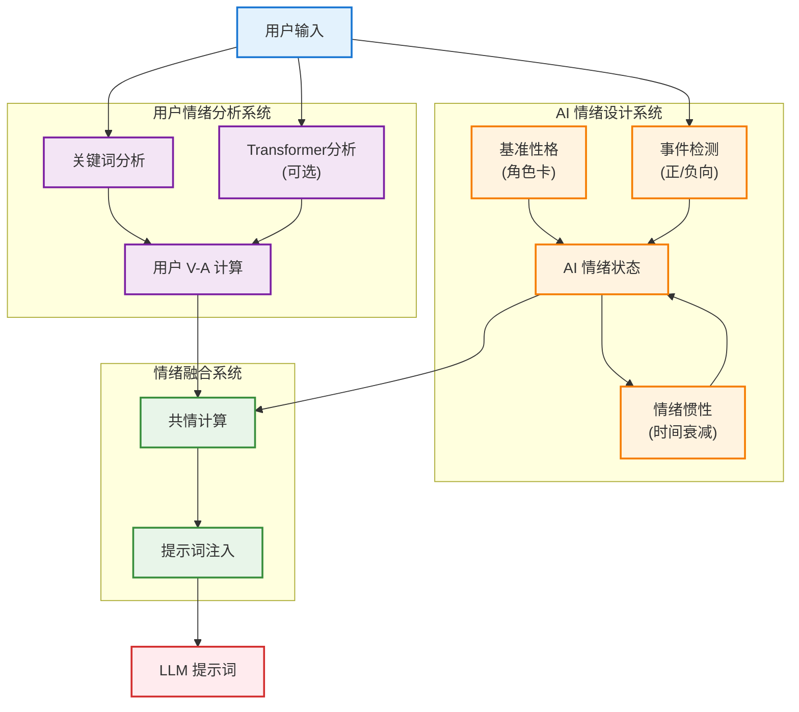
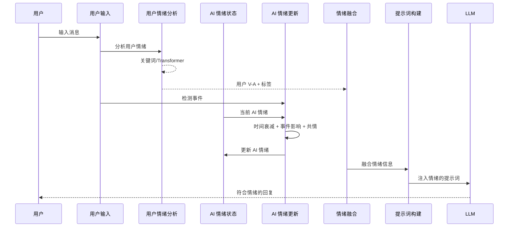

# 双重情绪引擎技术设计文档

## 目录

1. [设计概述](#1-设计概述)
2. [核心架构](#2-核心架构)
3. [核心模块](#3-核心模块)
4. [算法设计](#4-算法设计)
5. [配置参数](#5-配置参数)
6. [数据流程](#6-数据流程)

---

## 文档导航

| 相关文档 | 说明 |
|---------|------|
| [项目 README](../README.md) | 项目概览、快速开始 |
| [架构设计](./architecture.md) | 系统整体架构、模块划分 |
| [API 文档](./api.md) | 完整的 RESTful API 接口 |
| [记忆引擎](./memory-engine.md) | 记忆引擎详细设计 |

---

## 1. 设计概述

### 1.1 设计理念

Yumi 双重情绪引擎包含两个独立但协同的情绪系统：

| 系统 | 说明 |
|------|------|
| **用户情绪分析** | 理解用户的情绪状态 |
| **AI 情绪设计** | AI 拥有自己的情绪变化，像真人一样有"七情六欲" |

### 1.2 AI 情绪特性

- **基准性格**：角色卡设定的长期情绪基调
- **情绪惯性**：情绪变化有延迟，不会瞬间突变
- **共情能力**：AI 情绪会受用户情绪影响（但保持独立）
- **事件响应**：正向/负向事件会影响 AI 情绪
- **时间衰减**：情绪会慢慢回归基准值

### 1.3 技术栈

| 组件 | 技术 |
|------|------|
| 用户情绪分析 | 关键词匹配 + 可选 Transformer 模型 |
| AI 情绪状态 | 状态机 + 数值计算 |
| 情绪标签 | V-A 模型（效价-唤醒度） |

---

## 2. 核心架构



---

## 3. 核心模块

### 3.1 用户情绪分析模块

| 功能 | 说明 |
|------|------|
| 关键词分析 | 正负向词、高/低唤醒词匹配 |
| Transformer 分析 | 使用预训练模型（可选） |
| V-A 计算 | 输出 valence + arousal + 标签 |
| 置信度 | 匹配关键词时置信度更高 |

### 3.2 AI 情绪设计模块

| 功能 | 说明 |
|------|------|
| 基准性格 | 从角色卡读取基础情绪 |
| 事件检测 | 检测对话中的正/负向事件 |
| 情绪更新 | 综合多因素更新情绪 |
| 情绪惯性 | 情绪慢慢回归基准 |
| 状态持久化 | 保存当前情绪状态 |

### 3.3 情绪融合模块

| 功能 | 说明 |
|------|------|
| 共情计算 | AI 情绪向用户情绪"靠拢" |
| 提示词注入 | 将情绪信息注入 LLM 提示 |

---

## 4. 算法设计

### 4.1 用户情绪分析（V-A 模型）

**数据结构**：

| 字段 | 类型 | 范围 | 说明 |
|------|------|------|------|
| valence | float | [-1.0, 1.0] | 效价：消极到积极 |
| arousal | float | [0.0, 1.0] | 唤醒度：平静到激动 |
| label | str | - | 情绪标签 |
| confidence | float | [0.0, 1.0] | 置信度 |

**关键词计分规则**：

| 类型 | 关键词 | 效价影响 | 唤醒度影响 |
|------|--------|---------|-----------|
| 正向词 | 开心、快乐、喜欢、爱 | +0.15/词 | 0 |
| 负向词 | 难过、悲伤、讨厌、恨 | -0.15/词 | 0 |
| 高唤醒 | 激动、愤怒、害怕 | 0 | +0.1/词 |
| 低唤醒 | 平静、无聊、疲惫 | 0 | -0.1/词 |

**情绪标签映射**：

| Valence 区间 | Arousal 区间 | 标签 |
|--------------|--------------|------|
| > 0.5 | > 0.6 | 兴奋 |
| > 0.5 | ≤ 0.6 | 开心 |
| > 0.2 | ≤ 0.4 | 平静 |
| < -0.5 | > 0.6 | 愤怒 |
| < -0.5 | ≤ 0.6 | 悲伤 |
| < -0.2 | > 0.5 | 焦虑 |
| < -0.2 | ≤ 0.5 | 低落 |
| - | > 0.7 | 激动 |
| 其他 | 其他 | 中性 |

---

### 4.2 AI 情绪状态

**数据结构**：

| 字段 | 类型 | 范围 | 说明 |
|------|------|------|------|
| current_valence | float | [-1.0, 1.0] | 当前效价 |
| current_arousal | float | [0.0, 1.0] | 当前唤醒度 |
| base_valence | float | [-1.0, 1.0] | 基准效价（角色卡） |
| base_arousal | float | [0.0, 1.0] | 基准唤醒度（角色卡） |
| emotion_sensitivity | float | [0.0, 1.0] | 情绪敏感度 |
| last_updated | datetime | - | 最后更新时间 |

---

### 4.3 AI 情绪更新算法

**总体公式**：

$$
\text{AI\_情绪} = f(\text{基准性格}, \text{事件影响}, \text{用户情绪}, \text{时间衰减})
$$

---

#### 步骤 1：事件影响检测

**正向事件词**：开心、高兴、成功、好消息、太棒了

**负向事件词**：难过、失败、坏消息、糟糕、失望

**事件影响计算**：

$$
\begin{align*}
\Delta \text{valence} &= 0.2 \times N_{\text{positive}} - 0.2 \times N_{\text{negative}} \\
\Delta \text{arousal} &= 0.15 \times N_{\text{positive}} + 0.1 \times N_{\text{negative}}
\end{align*}
$$

其中：
- $N_{\text{positive}}$ = 正向事件词数量
- $N_{\text{negative}}$ = 负向事件词数量

---

#### 步骤 2：共情计算

**共情公式**：

$$
\Delta \text{valence}_{\text{empathy}} = (\text{user\_valence} - \text{ai\_valence}) \times \text{empathy\_factor} \times \text{user\_confidence}
$$

其中：
- $\text{empathy\_factor} \in [0.0, 1.0]$（推荐 0.3）
- 0.0 = 完全独立
- 0.3 = 平衡
- 0.7 = 高度共情
- 1.0 = 完全跟随用户

---

#### 步骤 3：时间衰减（情绪惯性）

**衰减因子**：

$$
\text{decay\_factor} = e^{-\frac{t}{T}}
$$

其中：
- $t$ = 经过的秒数
- $T$ = 半衰期（默认 1800 秒 = 30 分钟）
- $\text{decay\_factor} \in [0, 1]$

**衰减后的情绪**：

$$
\begin{align*}
\text{valence}_{\text{decay}} &= \text{base\_valence} + (\text{current\_valence} - \text{base\_valence}) \times \text{decay\_factor} \\
\text{arousal}_{\text{decay}} &= \text{base\_arousal} + (\text{current\_arousal} - \text{base\_arousal}) \times \text{decay\_factor}
\end{align*}
$$

---

#### 步骤 4：综合更新

**最终情绪**：

$$
\begin{align*}
\text{valence} &= \text{valence}_{\text{decay}} + (\Delta \text{valence} + \Delta \text{valence}_{\text{empathy}}) \times \text{sensitivity} \\
\text{arousal} &= \text{arousal}_{\text{decay}} + \Delta \text{arousal} \times \text{sensitivity}
\end{align*}
$$

**限幅**：

$$
\begin{align*}
\text{valence} &= \max(-1.0, \min(1.0, \text{valence})) \\
\text{arousal} &= \max(0.0, \min(1.0, \text{arousal}))
\end{align*}
$$

---

### 4.4 提示词注入

**提示词结构**：

```text
【角色设定】
{角色卡内容}

【AI 当前情绪】
- 情绪状态：{情绪标签}
- 愉悦度：{valence:.2f} (-1.0=消极 ~ 1.0=积极)
- 激动度：{arousal:.2f} (0.0=平静 ~ 1.0=激动)

【用户情绪】
- 情绪状态：{用户情绪标签}
- 愉悦度：{用户 valence:.2f}
- 激动度：{用户 arousal:.2f}

【回复要求】
1. 保持你当前的情绪状态进行回复
2. 对用户的情绪给予适当的共情回应
3. 不要暴露你在分析情绪
```

---

## 5. 配置参数

| 配置项 | 默认值 | 说明 |
|--------|--------|------|
| `emotion.detection_enabled` | true | 是否启用用户情绪分析 |
| `emotion.model` | `"keyword"` | 分析模型：`"keyword"` 或 `"transformer"` |
| `emotion.ai_emotion_enabled` | true | 是否启用 AI 情绪系统 |
| `emotion.empathy_factor` | 0.3 | 共情强度 (0.0-1.0) |
| `emotion.emotion_half_life` | 1800 | 情绪半衰期（秒），默认 30 分钟 |
| `emotion.default_base_valence` | 0.3 | 默认基准效价（角色卡未设置时） |
| `emotion.default_base_arousal` | 0.4 | 默认基准唤醒度（角色卡未设置时） |
| `emotion.default_sensitivity` | 0.7 | 默认情绪敏感度 (0.0-1.0) |

---

## 6. 数据流程

### 6.1 双重情绪处理流程



---

### 6.2 AI 情绪状态转换（示例）

时间轴：
- 用户分享好消息 → AI 情绪：开心 (valence 0.7, arousal 0.6)
- 10 分钟后（无交互）→ AI 情绪：微喜 (valence 0.5, arousal 0.45)（衰减向基准值 valence 0.3, arousal 0.4）
- 用户遇到困难 → 用户情绪：难过 (valence -0.6, arousal 0.7)，AI 情绪：担忧 (valence 0.0, arousal 0.55)（事件影响：-0.2，共情影响：-0.3）
- 20 分钟后 → AI 情绪：平静 (valence 0.2, arousal 0.42)
