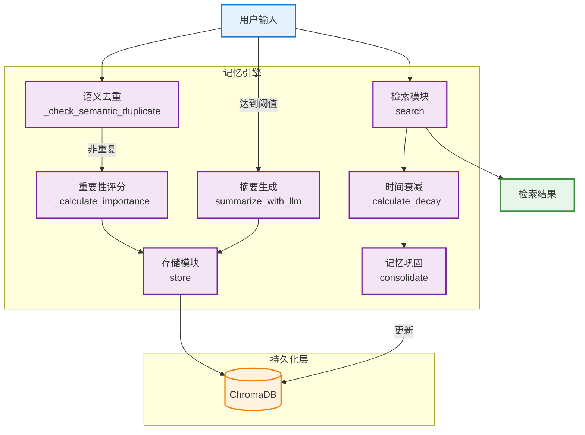
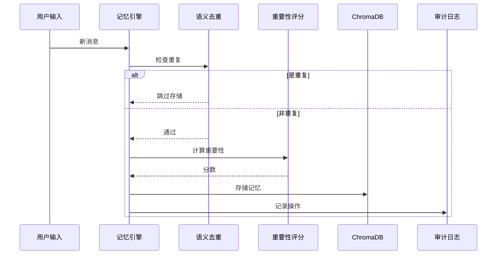
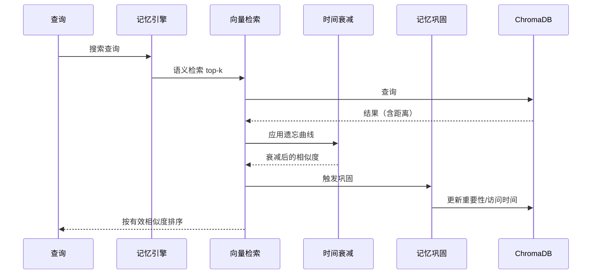
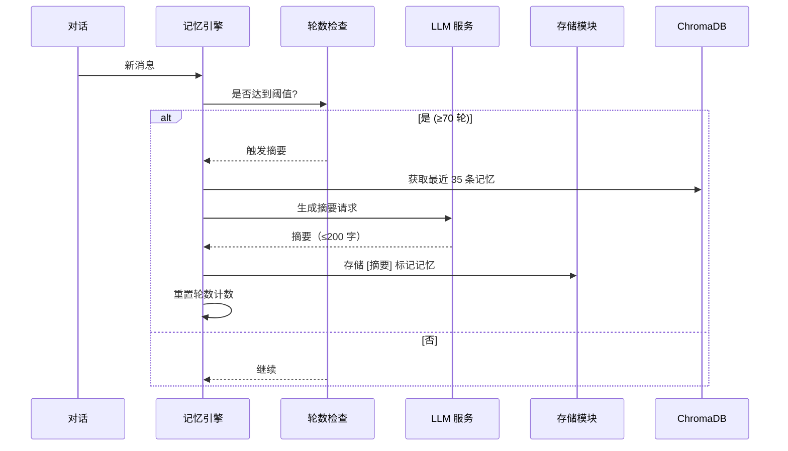

# 记忆引擎设计

## 目录

1. [设计概述](#1-设计概述)
2. [核心架构](#2-核心架构)
3. [核心模块](#3-核心模块)
4. [算法设计](#4-算法设计)
5. [配置参数](#5-配置参数)
6. [数据流程](#6-数据流程)

---

## 文档导航

| 相关文档 | 说明 |
|---------|------|
| [项目 README](../README.md) | 项目概览、快速开始 |
| [架构设计](./architecture.md) | 系统整体架构、模块划分 |
| [API 文档](./api.md) | 完整的 RESTful API 接口 |
| [情绪引擎](./emotion-engine.md) | 情绪引擎详细设计 |
| [RAG 技术说明](./rag-technical.md) | 检索增强生成：向量检索、相似度与 LLM 集成 |

---

## 1. 设计概述

### 1.1 设计理念

Yumi 记忆引擎基于**认知科学**与**向量检索技术**，模拟人类记忆的以下特性：

- **遗忘曲线**：记忆随时间逐渐淡化
- **语义关联**：通过向量相似度检索相关记忆
- **重要性评估**：关键信息优先级更高
- **记忆巩固**：被回忆的记忆会增强
- **对话摘要**：长期记忆压缩存储

### 1.2 技术栈

| 组件 | 技术 |
|------|------|
| 向量数据库 | ChromaDB 0.4.22 |
| 检索方式 | 语义相似度 + 时间衰减 |
| 去重策略 | 余弦相似度阈值 |
| 摘要生成 | LLM 调用 |

---

## 2. 核心架构

---

## 3. 核心模块

### 3.1 存储模块 (store)

| 功能 | 说明 |
|------|------|
| 语义去重 | 存储前检查相似度（阈值 0.85），避免重复 |
| 重要性评分 | 基于关键词计算记忆重要性 |
| 元数据记录 | 记录时间戳、用户 ID、重要性分数 |
| 审计日志 | 记录存储操作日志 |

### 3.2 检索模块 (search)

| 功能 | 说明 |
|------|------|
| 语义检索 | 基于向量相似度召回 top-k 记忆 |
| 时间衰减 | 应用艾宾浩斯遗忘曲线调整权重 |
| 记忆巩固 | 被检索到的记忆增强重要性 |
| 结果排序 | 按有效相似度降序排列 |

### 3.3 摘要模块 (summarize_with_llm)

| 功能 | 说明 |
|------|------|
| 触发条件 | 对话轮数达到阈值（默认 70 轮） |
| 输入 | 最近 35 条记忆 |
| 输出 | LLM 生成的 200 字以内摘要 |
| 存储 | 摘要标记为 `[摘要]` 单独存储 |

---

## 4. 算法设计

### 4.1 艾宾浩斯遗忘曲线（指数衰减 + 重要性调节）

**记忆强度（由重要性决定）**：

$$
S = 7 + \text{importance} \times 14
$$

其中：
- $S$ = 记忆强度（半衰期，单位：天）
- $\text{importance}$ = 记忆重要性分数 (0.0-1.0)
- $S \in [7, 21]$ 天

**衰减因子**：

$$
\text{decay-factor} = e^{-\frac{t}{S}}
$$

其中：
- $t$ = 经过的天数
- $\text{decay-factor} \in [\text{min-decay-factor}, 1.0]$

**有效相似度**：

$$
\text{effective-similarity} = \text{similarity} \times \text{decay-factor}
$$

**直观理解**：
- 重要记忆（importance = 0.9）→ $S = 7 + 12.6 = 19.6$ 天 → 衰减慢
- 不重要记忆（importance = 0.1）→ $S = 7 + 1.4 = 8.4$ 天 → 衰减快

---

### 4.2 重要性评分算法

**基础分数**：0.5

| 类型 | 关键词 | 加分 |
|------|--------|------|
| 情感词 | 喜欢、讨厌、爱、恨 | +0.08 |
| 重要信息 | 记住、忘记、生日、名字、工作 | +0.08 |
| 个人相关 | 家、梦想、目标、家人、朋友、健康 | +0.08 |
| 疑问词 | 为什么、怎么、如何、什么 | +0.05 |

**最大值**：1.0

---

### 4.3 记忆巩固机制

**触发条件**：记忆被检索到

**效果**：
1. 重要性分数提升 10%（上限 1.0）
2. 更新记忆的最后访问时间
3. 下次检索时衰减更慢

---

### 4.4 语义去重

**相似度计算**：

$$
\text{similarity} = 1 - \text{cosine-distance}
$$

其中：
- $\text{cosine-distance}$ = ChromaDB 返回的余弦距离，范围 $[0, 1]$
- $\text{similarity}$ = 余弦相似度，范围 $[0, 1]$

**去重判断**：

$$
\text{is-duplicate} = (\text{similarity} \geq \text{threshold})
$$

**阈值**：0.85（推荐值，范围 0.80-0.90）

| 阈值 | 说明 |
|------|------|
| 0.95 | 非常严格，仅完全一致才算重复 |
| **0.85** | **平衡推荐，语义相似即算重复** |
| 0.75 | 宽松，稍微相关即算重复 |

---

## 5. 配置参数

| 配置项 | 默认值 | 说明 |
|--------|--------|------|
| `vector_db.persist_dir` | `./data/vector_db` | ChromaDB 持久化目录 |
| `vector_db.collection_name` | `yumi_memories` | 集合名称 |
| `memory.rag_top_k` | 6 | 检索返回数量 |
| `memory.recent_context_limit` | 20 | 近期记忆数量 |
| `memory.decay_rate` | 0.03 | （保留用于兼容） |
| `memory.min_decay_factor` | 0.1 | 最小衰减因子 |
| `memory.summary_threshold` | 70 | 摘要触发轮数 |
| `memory.summary_context_size` | 35 | 摘要输入记忆数 |
| `memory.deduplication_threshold` | 0.85 | 去重相似度阈值 |
| `memory.consolidation_boost` | 0.1 | 记忆巩固提升比例 |

---

## 6. 数据流程

### 6.1 记忆存储流程

---

### 6.2 记忆检索流程

---

### 6.3 摘要生成流程

