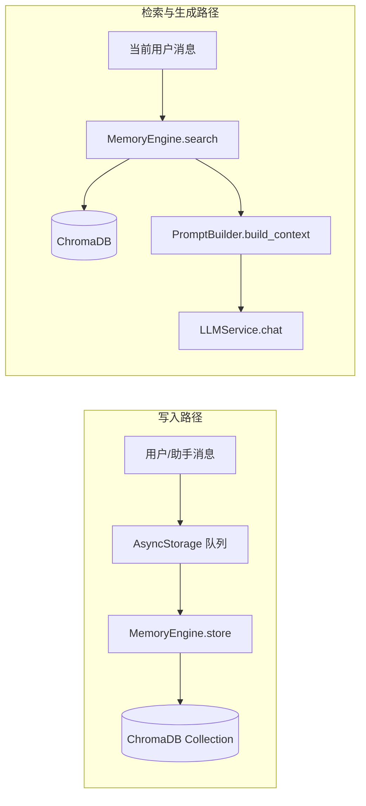

# Yumi RAG（检索增强生成）技术说明

本文档基于当前代码实现，说明 Yumi 中长期记忆与 **RAG** 相关的算法原理、数据流与生成模型集成方式。范围覆盖后端 `MemoryEngine`、对话路由、`PromptBuilder` 与异步向量写入链路。

---

## 1. 概念界定

在本项目中，**RAG** 指：以用户当前输入为 **查询（Query）**，从 **向量库（ChromaDB）** 中检索与历史对话相关的 **记忆片段**，再将检索结果以 **唯一一条 system 提示词**（角色卡 + 情绪 + 记忆摘要 + RAG 详情附录）注入 **大语言模型（LLM）** 的上下文，与 **会话历史（SQLite `conversation_logs`）** 等共同构成完整 `messages[]`，最后调用统一 LLM 接口生成回复。

> **注意**：检索对象主要是「异步写入向量库的对话记忆」，与「当前会话的逐条聊天记录」来源不同；二者在 `PromptBuilder.build_context` 中分层组装。

---

## 2. 总体架构与数据流



| 阶段 | 模块 | 作用 |
|------|------|------|
| 索引 | `MemoryEngine.store` | 文本入库；可选语义去重；写入元数据（`user_id`、`timestamp`、`importance_score` 等） |
| 检索 | `MemoryEngine.search` | 以当前消息为 query 做 Top-K 相似检索；时间衰减；记忆巩固 |
| 组装 | `PromptBuilder.build_context` | **单条** System（角色卡 + 情绪 + **记忆摘要条** + **RAG 检索附录**）+ 规范化 **user/assistant 交替** 的历史 + **末条 user**（当前问题） |
| 生成 | `LLMService.chat` | OpenAI 兼容 API，多轮 `messages` 一次请求 |

---

## 3. 向量存储与向量化方法

### 3.1 存储引擎

- **库**：**ChromaDB**（持久化目录由配置 `YUMI_VECTOR_PERSIST_DIR` / `config.yaml` 中 `vector_db.persist_dir` 指定，默认 `data/chroma`）。
- **集合**：集合名由 `YUMI_VECTOR_COLLECTION_NAME` 等配置，默认 `echo_memory`。
- **写入方式**：代码通过 `collection.add(documents=[content], metadatas=[...], ids=[...])` 传入**原始文本**，**未在业务代码中显式传入 embedding 向量**。

### 3.2 嵌入（Embedding）与距离空间

- Chroma 在 `add` 时若未提供 `embeddings`，会使用其 **默认嵌入函数** 将 `documents` 编码为向量（具体模型与维度以当前安装的 `chromadb` 版本默认行为为准；常见为基于 **Sentence-Transformers** 的英文句向量模型，在 **余弦空间** 上做近邻检索）。
- **实现层面**：业务层只操作**字符串内容**；向量维度与模型名称以运行环境 Chroma 默认配置为准。若需固定模型或中英优化，需在 Chroma 侧配置自定义 `EmbeddingFunction`（当前仓库未封装该层，属于扩展点）。

### 3.3 写入内容形态

异步存储任务 `_store_to_vector` 将单条消息存为：

```text
[{user|assistant}] {原始 content}
```

元数据中包含 `conversation_id`、`message_id`、`role`、`timestamp` 及可选情绪数值等，便于审计与过滤；**检索时的用户隔离**主要依赖元数据中的 `user_id`（见下节）。

---

## 4. 检索机制（核心算法流程）

### 4.1 查询入口

对话处理中（非 debug）在 `_build_context_and_emotion`（[`backend/routers/chat.py`](backend/routers/chat.py)）内调用：

```python
relevant_memories = await memory_engine.search(
    query=request.message,
    user_id=request.userId,
)
```

默认 `top_k = settings.memory.rag_top_k`（如 **6**），并可按配置关闭衰减等（参数 `apply_decay`）。

### 4.2 过滤与 Top-K

- `collection.query(query_texts=[query], n_results=top_k, where={"user_id": user_id}, ...)`  
  即：**仅检索该 `user_id` 下的记忆**，避免跨用户污染。

### 4.3 相似度与「有效相似度」

Chroma 返回的 `distances` 与向量空间定义一致；业务代码中采用：

```text
similarity = 1 - distance
```

在 **启用时间衰减** 时，对每条命中结果计算：

```text
effective_similarity = similarity × decay_factor
```

其中 `decay_factor` 由 **艾宾浩斯型指数衰减** 与 **重要性** 共同决定（见 [`memory-engine.md`](./memory-engine.md) 与 `MemoryEngine._calculate_decay`）：  
记忆越旧、重要性越低，则 `decay_factor` 越小，排序越靠后。

### 4.4 重排序与截断

- 按 `effective_similarity` **降序**排序。
- 对命中记忆执行 **记忆巩固（consolidate）**：适度提升 `importance_score` 等（可配置 `consolidation_boost`），并更新访问相关信息。
- 最终返回 **前 `top_k` 条**。

### 4.5 语义去重（写入侧，非检索主路径）

写入前 `_check_semantic_duplicate` 用同一用户下 **小样本查询**（如 `n_results=3`），若 `1 - min(distance) ≥ deduplication_threshold`（默认 **0.85**）则视为重复，**跳过写入**。这与检索时的相似度定义一致，减少冗余向量。

---

## 5. 相似度计算方式（实现口径）

| 项目 | 说明 |
|------|------|
| 向量相似度 | 由 Chroma 在默认嵌入空间内计算 query 与文档向量的 **距离** `distance` |
| 业务相似度 | `similarity = 1 - distance`（与 [`memory-engine.md`](./memory-engine.md) 中「余弦距离 → 相似度」的表述一致） |
| 排序依据 | 优先使用 **有效相似度** `effective_similarity`（含时间衰减） |
| 阈值用途 | `deduplication_threshold` 仅用于 **是否跳过写入**，不直接裁剪检索 Top-K |

---

## 6. 与生成模型的集成方式

### 6.1 上下文组装顺序（`PromptBuilder.build_context`）

最终发给 LLM 的 `messages` 满足：**仅一条 system（索引 0）**；其后 **user/assistant 严格交替**；**最后一条必须是 user**（当前问题）。

1. **`role: system`（唯一）**  
   - **角色身份模板**（`SYSTEM_PROMPT_TEMPLATE`），其中 **「关键记忆摘要」** 来自 **同一次检索结果** `_format_memory_summary_bullets(memories)`：对 `memories[:rag_top_k]` 每条取前 **100 字符** 做成 bullet 列表，**不再二次调用** `memory_engine.search`（避免重复检索）。  
   - 若有可展示的检索条，在同一 system 正文末尾追加 **`## 【RAG 检索相关记忆】`** 与条目列表（`_format_rag_detail_appendix`），**不再**使用第二条 `role: system`。

2. **会话历史**（若存在 `conversation_id`）  
   通过 `conversation_service.get_conversation_history` 拉取近期对话，经 `finalize_history_and_current_message`：**仅保留 user/assistant**、**合并连续同角色**、**去掉开头孤立 assistant**；若历史以 **未回复的 user** 结尾，则与本轮输入合并为 **一条** 最终 user。

3. **当前轮 `role: user`**  
   经规范化后的 **最终用户正文**（可能与 `current_message` 合并）。

### 6.2 LLM 调用

- 由 `LLMService.chat(messages=..., temperature=..., provider_id=..., base_url=..., api_key=..., model_name=..., use_thinking=...)` 发起请求，与 **OpenAI Chat Completions 兼容** 的网关通信。
- **RAG 不单独微服务**：检索在 Python 进程内完成，结果以 **纯文本** 进入 prompt，无独立「Reranker」服务。

### 6.3 Debug 模式

当 `settings.app.debug` 为真时，**跳过** 情绪分析与 **记忆检索**（`relevant_memories` 为空），用于本地调试 UI 或规避外部分依赖。

---

## 7. 记忆写入与 RAG 的时序关系

- **读路径**：本轮请求内 **同步** `memory_engine.search` → 立即参与 `build_context`。
- **写路径**：用户/助手消息经 **异步队列** 落 SQLite 后，再 `_store_to_vector` 调用 `MemoryEngine.store`；因此 **刚发送的第一条内容可能尚未进入向量库**，下一轮对话才可被检索。这是典型的 **近实时索引** 模型。

---

## 8. 摘要与长期压缩（与 RAG 相关但独立）

- `summarize_with_llm`：取近期若干条记忆文本，拼成摘要 prompt，调用 **同一 LLMService** 生成摘要，再以 `[摘要] ...` 形式 **存回向量库**（`skip_dedup=True`）。
- 触发策略由路由/业务中的 **轮数计数** 与配置 `summary_trigger_turns` 等决定（详见 [`memory-engine.md`](./memory-engine.md) 与 `chat` 路由实现）。

---

## 9. 关键配置项（环境变量前缀见 `backend/core/config.py`）

| 配置项 | 含义（典型） |
|--------|----------------|
| `YUMI_VECTOR_PERSIST_DIR` | Chroma 持久化目录 |
| `YUMI_VECTOR_COLLECTION_NAME` | 集合名 |
| `YUMI_MEMORY_RAG_TOP_K` | 检索条数上限 |
| `YUMI_MEMORY_RECENT_CONTEXT_LIMIT` | 近期记忆条数（用于其它逻辑，如 `get_recent`） |
| `YUMI_MEMORY_DEDUPLICATION_THRESHOLD` | 写入前去重相似度阈值 |
| `YUMI_MEMORY_MIN_DECAY_FACTOR` | 时间衰减下限 |
| `YUMI_MEMORY_CONSOLIDATION_BOOST` | 检索命中后的巩固强度 |

---

## 10. 小结与扩展建议

| 能力 | 当前实现要点 |
|------|----------------|
| 检索 | Chroma 文本 query + `user_id` 过滤 + Top-K + 时间衰减排序 |
| 向量化 | 依赖 Chroma 默认嵌入，业务不显式管理向量 |
| 相似度 | `1 - distance` + 衰减因子得到有效相似度 |
| 生成 | 单路 OpenAI 兼容 `chat`；RAG 结果全部并入 **唯一** system 正文 |

**可选扩展**：自定义 Embedding、重排序（Cross-Encoder）、混合检索（关键词 + 向量）、按 `conversation_id` 元数据过滤记忆等，均可在 `MemoryEngine` 与 `PromptBuilder` 层扩展，而不改变「检索 → 拼 prompt → LLM」的总体形态。

---

## 11. 相关文档与代码索引

| 资源 | 路径 |
|------|------|
| 记忆引擎产品设计 | [memory-engine.md](./memory-engine.md) |
| 记忆引擎实现 | `backend/services/memory.py` |
| 提示词与 RAG 注入 | `backend/services/prompt_builder.py` |
| 对话入口与检索调用 | `backend/routers/chat.py`（`_build_context_and_emotion`） |
| 向量异步写入 | `backend/services/async_storage.py`（`_store_to_vector`） |
| 配置 | `backend/core/config.py`（`VectorDBConfig`、`MemoryConfig`） |
